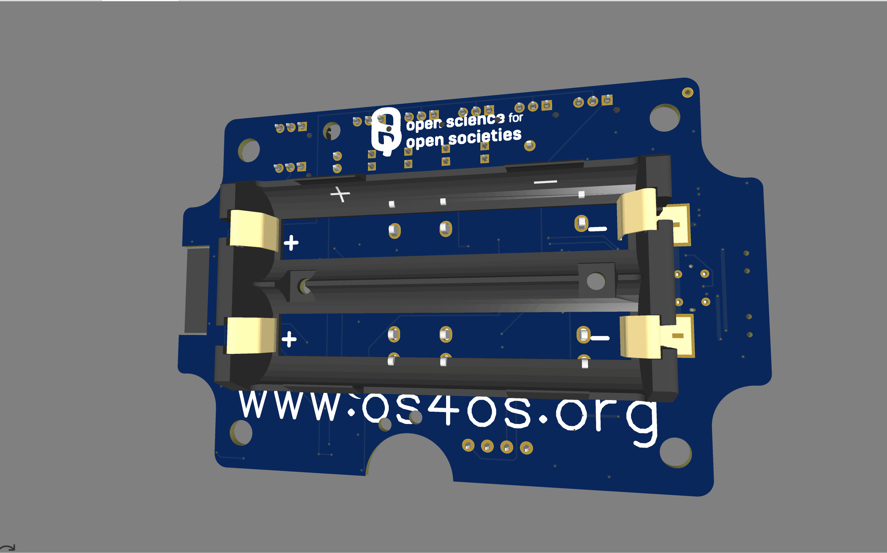

# Documentation of the os4os ESP32 board

Overview
--------
This repository contains the firmware, payload decoder and minimal documentation for the ParKli os4os ESP32 board, the sensor is used for water-quality water quality measurements. The device measures battery level, conductivity (TDS), pH, up to five DS18B20 temperatures, an optional analog sensor, and a BME280 (air temperature, pressure, humidity). Data is sent via LoRa (TTN/OTAA).

Further information
-----------------
https://datahub.openscience.eu/dataset/parkli-boje  
https://parkli.de/

Repository layout
-----------------
- [src_code/main.ino](src_code/main.ino) — Main ESP32 Arduino sketch with LMIC LoRaWAN integration; key functions: [`do_send`](src_code/main.ino), [`refreshSensorData`](src_code/main.ino), [`setSleepTime`](src_code/main.ino), [`getCellLvlPercent`](src_code/main.ino), [`getBootCycle`](src_code/main.ino), [`onEvent`](src_code/main.ino), [`checkTxIntervalWatchdog`](src_code/main.ino), [`enforceBackoffLimit`](src_code/main.ino).
- [TTN_Decoder/decoder.txt](TTN_Decoder/decoder.txt) — TTN payload formatter / decoder used on The Things Network; exposes [`decodeUplink`](TTN_Decoder/decoder.txt), [`decodeSigned16Bit`](TTN_Decoder/decoder.txt), [`moveComma`](TTN_Decoder/decoder.txt).
- [Documentation/test.txt](Documentation/test.txt) — placeholder/notes.
- [Images/](Images/) — Images of the PCB board and settings in Arduino IDE for code upload.

Firmware summary
----------------
- Power management: measures battery via ADC, computes percent in [`getCellLvlPercent`](src_code/main.ino), and gates deep-sleep duration via [`setSleepTime`](src_code/main.ino).
- Sensors:
  - DS18B20 via OneWire / DallasTemperature (up to 5 sensors).
  - BME280 via I2C (address probing 0x76 / 0x77).
  - Analog sensors: TDS (conductivity), pH, and an optional analog input.
- Transmission:
  - OTAA join with LMIC; join and TX event handling in [`onEvent`](src_code/main.ino).
  - Data packed into a 30‑byte payload inside `buffer` and sent from [`do_send`](src_code/main.ino).
  - Watchdog/backoff safety: [`checkTxIntervalWatchdog`](src_code/main.ino) and [`enforceBackoffLimit`](src_code/main.ino).

TTN Payload decoder
-------------------
Use the TTN JavaScript decoder in [TTN_Decoder/decoder.txt](TTN_Decoder/decoder.txt). It maps raw bytes to:
- BatterieRAW, BatterieProzent
- Leitwert (TDS), PH, Optional_Sensor
- Temperatur_1..5, Air_Temperature (scaled by 1/100)
- Pressure, Humidity
- Aufruf (boot counter)

Build / flash
-------------
1. Open [src_code/main.ino](src_code/main.ino) in the Arduino IDE or PlatformIO (ESP32 board).
2. Install required libraries: 
   - MCCI LoRaWAN LMIC library https://github.com/mcci-catena/arduino-lmic, 
   - DallasTemperature https://github.com/milesburton/Arduino-Temperature-Control-Library, 
   - OneWire https://www.pjrc.com/teensy/td_libs_OneWire.html, 
   - Adafruit BME280 https://github.com/adafruit/Adafruit_BME280_Library,  
The board is testet with the following versions MCCI LoRaWAN LMIC library(4.1.1), DallasTemperature(3.9.0), (2.3.8), Adafruit BME280(2.2.4), Adafruit_Sensor()
3. Install board in board managers, and choose ESP32-WROOM-DA Module https://github.com/espressif/arduino-esp32 
4. Update OTAA credentials in the sketch (APPEUI / DEVEUI / APPKEY). The credentials can be obtained from your LORA network server, e.g., the TTN console  
5. Compile and flash to the ESP32.

Notes & troubleshooting
-----------------------
- If battery percent is low, the device enforces long deep-sleep.
- Large LoRa backoff forces a longer sleep via [`enforceBackoffLimit`](src_code/main.ino).
- Serial prints are available at 115200 baud for debugging.

License and credits
-------------------
Copyright 2025 os4os
This project is licensed under the MIT License — see the included LICENSE file for details.

Contact
-------
Use repository issues for questions or debugging.

Contact
-------
Use repository issues for questions or debugging.